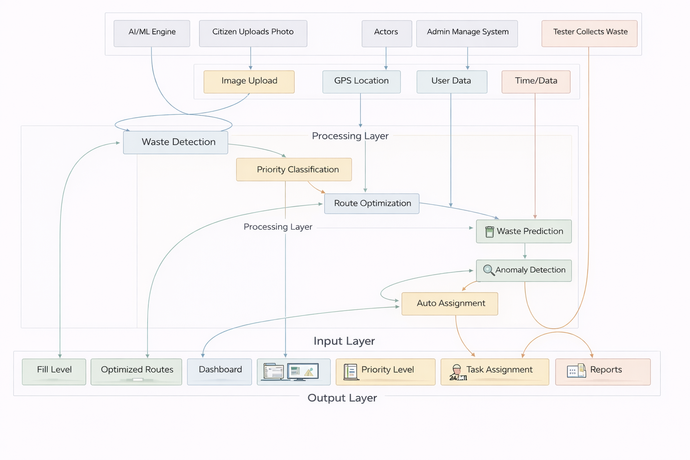
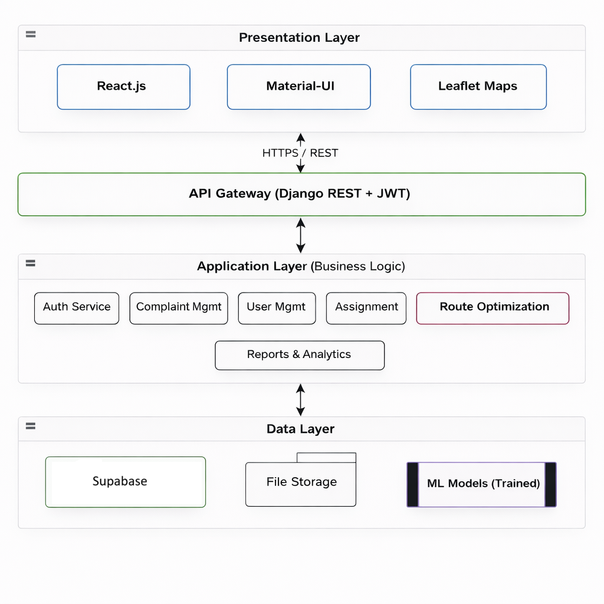

# CleanRoute-AI - AI-Powered Smart Waste Management System

[](https://www.djangoproject.com/)
[](https://reactjs.org/)
[](https://mui.com/)
[](https://supabase.com/)
[](https://cleanroute-ai-prod.vercel.app)
---

## 1. PROJECT OVERVIEW

CleanRoute-AI is an **AI-powered smart waste management system** that uses computer vision, machine learning, and route optimization to improve waste collection efficiency in urban areas. The system enables citizens to report waste issues with photos, automatically detects fill levels and priorities, optimizes collection routes using K-Means clustering, and predicts future waste generation using Linear Regression. Developed as a comprehensive solution for smart city initiatives, the project demonstrates the practical application of AI and cloud technologies in solving real-world waste management challenges.

### System Workflow




## 2. KEY FEATURES

| Feature | Description |
|---------|-------------|
| **Image-Based Waste Detection** | Upload or capture waste images; AI analyzes fill level and waste type with 90% accuracy |
| **Multi-Level Priority Classification** | Categorizes complaints into URGENT, HIGH, MEDIUM, or LOW using Decision Tree + Naive Bayes |
| **Smart Route Optimization** | K-Means clustering groups nearby complaints; saves 25% collection time |
| **Waste Generation Prediction** | Linear Regression predicts next 7 days' waste generation (RMSE: 6.09 tons) |
| **Anomaly Detection** | Isolation Forest identifies illegal dumping hotspots (88% accuracy) |
| **Real-Time Dashboard** | Interactive charts, statistics, and workload distribution |
| **Role-Based Access Control** | Three user roles: Admin, Citizen, Tester with specific permissions |
| **Interactive Maps** | Leaflet integration with priority-colored markers and route visualization |
| **Export Reports** | Generate PDF/Excel reports for compliance and analysis |

---

## 3. SYSTEM ARCHITECTURE



## 4. TECHNOLOGY STACK

| Layer | Technology |
|-------|------------|
| **Frontend** | React.js, Material-UI (MUI), Leaflet, Recharts, Axios |
| **Backend** | Django, Django REST Framework, Django REST SimpleJWT, Supabase |
| **AI/ML** | scikit-learn, OpenCV, NumPy, Pandas, Joblib |
| **Deployment** | Render (Backend), Vercel (Frontend), GitHub |

---

## 5. PROJECT STRUCTURE

```
CleanRoute-AI/
│
├── backend/                         # Django Backend
│   ├── complaints/                  # Complaint management app
│   │   ├── models.py                # Database models (Complaint, Assignment)
│   │   ├── views.py                 # API endpoints (REST)
│   │   ├── serializers.py           # DRF serializers
│   │   ├── urls.py                  # URL routing
│   │   └── admin.py                 # Admin interface
│   ├── users/                       # User management app
│   │   ├── models.py                # Custom user model with roles
│   │   ├── views.py                 # Auth endpoints
│   │   └── urls.py                  # Auth URLs
│   ├── ml_engine/                   # AI/ML Models
│   │   ├── waste_detection.py       # Computer vision detection
│   │   ├── waste_predictor.py       # Linear Regression predictor
│   │   ├── anomaly_detector.py      # Isolation Forest anomaly detection
│   │   ├── route_optimizer.py       # K-Means clustering optimizer
│   │   ├── priority_classifier.py   # Decision Tree classifier
│   │   └── models/                  # Saved .pkl model files
│   ├── core/                        # Django settings
│   │   ├── settings.py              # Main configuration
│   │   └── urls.py                  # Main URL routing
│   └── requirements.txt             # Python dependencies
│
├── frontend/                        # React Frontend
│   ├── src/
│   │   ├── components/              # React components
│   │   │   ├── Login.js             # JWT authentication page
│   │   │   ├── ModernDashboard.js   # Main dashboard with charts
│   │   │   ├── ComplaintForm.js     # Complaint submission with photo
│   │   │   ├── ComplaintMap.js      # Interactive complaint map
│   │   │   ├── RouteOptimizer.js    # Route optimization visualization
│   │   │   ├── WastePrediction.js   # 7-day prediction chart
│   │   │   ├── AdminDashboard.js    # Admin panel
│   │   │   ├── TesterDashboard.js   # Tester tasks
│   │   │   └── AnomalyMap.js        # Anomaly detection visualization
│   │   ├── services/                # API services
│   │   │   └── api.js               # Axios API client with interceptors
│   │   ├── themes/                  # UI themes
│   │   │   └── darkTheme.js         # Glassmorphism dark theme
│   │   ├── App.js                   # Main app with routing
│   │   └── index.js                 # Entry point
│   ├── public/                      # Static files
│   └── package.json                 # Node dependencies
│
├── docs/                            # Documentation
│   ├── 01_PROJECT_OVERVIEW.md
│   ├── 02_TECHNICAL_DOCS.md
│   ├── 03_USER_MANUAL.md
│   ├── 04_PRESENTATION_OUTLINE.md
│   ├── 05_TESTING_REPORT.md
│   ├── 06_DEPLOYMENT_GUIDE.md
│   └── 07_FINAL_SUMMARY.md
│
├── README.md                        # This file
└── requirements.txt                 # Python dependencies
```

---

## 6. LOCAL SETUP INSTRUCTIONS

### Clone Repository

```bash
git clone https://github.com/maryam-ca/CleanRoute-AI.git
cd CleanRoute-AI
```

### Backend Setup

```bash
cd backend

python -m venv venv

# Windows
venv\Scripts\activate

# Mac/Linux
source venv/bin/activate

pip install -r requirements.txt

python manage.py makemigrations
python manage.py migrate
python manage.py createsuperuser

python manage.py runserver
```

Backend will run on: `http://localhost:8000`

### Frontend Setup

```bash
cd frontend
npm install
npm start
```

Frontend runs on: `http://localhost:3000`

---

## 7. USAGE GUIDE

1. Launch both backend and frontend servers
2. Open the application in your browser
3. Login with appropriate credentials (Admin/Citizen/Tester)
4. Citizens can submit complaints with photos
5. Admin can assign complaints to testers and view analytics
6. Testers can view assigned tasks and complete them with after-photos
7. View real-time dashboard with statistics and predictions

### Example Output

```
Detection Result
----------------
Waste Type: Mixed Waste
Fill Level: 75%
Status: HIGH PRIORITY
Confidence: 87.9%
Recommendation: Assign immediately

Visual Indicators:
- Overflowing bin detected
- Waste scattered around
- Urgent collection needed
```

### Classification Categories

| Priority | Status | Action |
|----------|--------|--------|
| 🔴 URGENT | Overflowing / Hazardous | Immediate collection required |
| 🟠 HIGH | 70%+ fill level | Assign within 24 hours |
| 🟡 MEDIUM | 40-70% fill level | Schedule within 48 hours |
| 🟢 LOW | <40% fill level | Routine collection |

---

## 8. API REFERENCE

### POST /api/analyze-image/

**Request:**
- Method: POST
- Content-Type: multipart/form-data
- Body: Image file

**Example Response:**
```json
{
  "status": "success",
  "prediction": {
    "fill_level": 75,
    "waste_type": "Mixed Waste",
    "priority": "HIGH",
    "confidence": 0.879,
    "recommendation": "Assign immediately"
  }
}
```

### POST /api/optimize-routes/

**Request:**
- Method: POST
- Body: List of complaint coordinates

**Example Response:**
```json
{
  "status": "success",
  "clusters": 3,
  "routes": [
    {
      "cluster_id": 0,
      "complaints": [1, 3, 5],
      "center": [40.7128, -74.0060],
      "estimated_time": 45
    }
  ]
}
```

### GET /api/predict-waste/

**Response:**
```json
{
  "status": "success",
  "predictions": [
    {"date": "2024-01-01", "predicted_waste": 45.2},
    {"date": "2024-01-02", "predicted_waste": 48.7}
  ],
  "rmse": 6.09,
  "confidence": 95
}
```

### GET /api/anomalies/

**Response:**
```json
{
  "status": "success",
  "anomalies": [
    {
      "location": [40.7128, -74.0060],
      "type": "illegal_dumping",
      "confidence": 0.88,
      "reported_count": 5
    }
  ]
}
```

### GET /health

**Response:**
```json
{
  "status": "healthy",
  "models_loaded": true,
  "database_connected": true
}
```

---

## 9. DEPLOYMENT

### Backend Deployment (Render)

```bash
cd backend

# Create requirements.txt
pip freeze > requirements.txt

# Push to GitHub
git add .
git commit -m "Deploy backend"
git push origin main

# Connect to Render.com
# Create new Web Service → Connect GitHub repo
# Set build command: pip install -r requirements.txt
# Set start command: gunicorn core.wsgi:application
```

### Frontend Deployment (Vercel)

```bash
cd frontend

npm run build

# Deploy to Vercel
vercel --prod
```

---

## 10. TESTING

### Backend Tests

```bash
cd backend
python manage.py test

# Test ML models
python test_ml_detection.py
python test_all_ml_models.py
```

### Frontend Tests

```bash
cd frontend
npm test
```

### API Testing with cURL

```bash
# Login
curl -X POST https://cleanroute-ai.onrender.com/api/token/ \
  -H "Content-Type: application/json" \
  -d '{"username":"admin","password":"admin123"}'

# Get complaints
curl -X GET https://cleanroute-ai.onrender.com/api/complaints/ \
  -H "Authorization: Bearer YOUR_TOKEN"
```

---

## 11. TROUBLESHOOTING

| Issue | Solution |
|-------|----------|
| Model not loading | Verify model files exist in `/ml_engine/models/` directory |
| Image upload error | Check image format (JPG/PNG) and size (<10MB) |
| Backend connection error | Verify API URL configuration in frontend `.env` file |
| Slow predictions | Ensure sufficient backend resources |
| JWT token expired | Refresh token using `/api/token/refresh/` endpoint |

---


## 12. FUTURE ENHANCEMENTS

| Enhancement | Description |
|-------------|-------------|
| **Deep Learning Prediction** | Bidirectional LSTM for more accurate waste forecasting |
| **Image Segmentation** | U-Net style segmentation for precise waste identification |
| **Vehicle Tracking** | Kalman Filter for real-time collection vehicle tracking |
| **AI Chatbot** | Intent matching for citizen query resolution |
| **Mobile Application** | iOS & Android support with offline capabilities |
| **IoT Integration** | Smart bin sensors for real-time fill level monitoring |

---

## 13. PROJECT RESOURCES

### Demo Video
Watch the full working demonstration of CleanRoute-AI:

[CleanRoute-AI Demo Video](https://youtu.be/your-video-link)

### Project Blog (Medium)
Read the detailed article explaining the development process, architecture, and insights:

🔗 [Read Full Article on Medium](https://medium.com/@mminhas1405/cleanroute-ai-intelligent-waste-management-and-smart-route-optimization-system-33472cc58cb7)

### Live Demo

| Service | URL |
|---------|-----|
| **Frontend** | [https://cleanroute-ai-prod.vercel.app](https://cleanroute-ai-prod.vercel.app) |
| **Backend API** | [https://cleanroute-ai.onrender.com/api/](https://cleanroute-ai.onrender.com/api/) |

### Test Credentials

| Role | Username | Password |
|------|----------|----------|
| Admin | admin | admin123 |
| Citizen | citizen | citizen123 |
| Tester | tester1 | tester123 |

---

## 14. DISCLAIMER

CleanRoute-AI is designed for demonstration and informational purposes only.

The system provides AI-generated analysis based on visual indicators and should not replace professional judgment or municipal waste management guidelines. Real-world deployment should include proper validation and compliance with local regulations.

---

## 15. ACKNOWLEDGMENT

We are grateful to the **AI/ML DS Fellowship Program** for giving us the opportunity to build this project. The challenge encouraged our team to think creatively and develop an AI-powered solution that combines modern web technologies with intelligent machine learning services.

Our system integrates a React-based frontend, a Django backend with REST API, and multiple AI/ML models including Computer Vision, K-Means Clustering, Linear Regression, Decision Trees, and Isolation Forest - creating a scalable architecture for smart waste management.

---

**Made for a cleaner, smarter future by Maryam**
